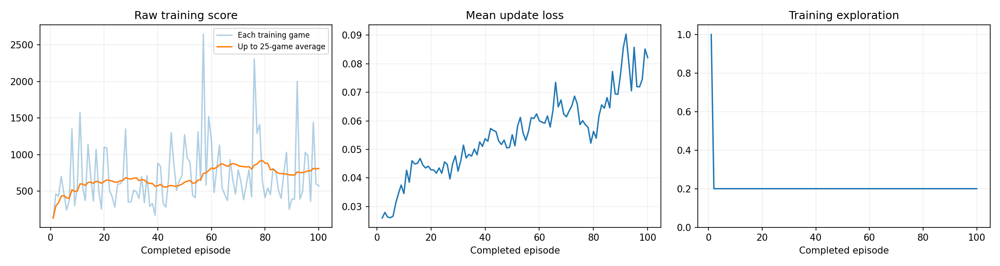
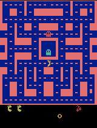
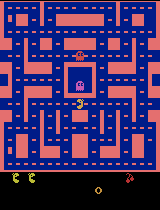

# trainmyfirstmodel

My first reinforcement learning experiment: training a Deep Q-Network to play Ms. Pac-Man.

Public repository target: <https://github.com/esidentu/trainmyfirstmodel>

Original executed Colab notebook: <https://colab.research.google.com/drive/1GbYqelRPSs4e1y1nG4w9lfNsjr5iZmP->

The run used the class notebook `pacman_dqn.ipynb`. Because the Colab notebook download and Colab-to-GitHub save flow were blocked by browser/GitHub authorization during recovery, the local `pacman_dqn.ipynb` in this folder was reconstructed from the executed Colab page. It preserves the rendered cells, visible text outputs, training dashboard, and GIF outputs recovered from that executed page. The Colab link above remains the authoritative executed session.

## My three choices

| Setting | Value | Why I chose it |
|---|---:|---|
| Exploration | `0.20` | The agent still tries random moves 20% of the time, but usually follows the learned value estimates. |
| Episodes | `100` | This is long enough to pass the 25-episode artifact requirement and still practical for a class-sized Colab run. |
| Learning rate | `0.0001` | A small learning rate should make updates steadier and reduce the chance of unstable learning. |

I expected these settings to improve the average score because the network would see many game states, keep replay examples, and update its action values while still exploring enough to discover useful moves.

## Run summary

| Item | Result |
|---|---:|
| Status | completed |
| Completed episodes | 100 |
| Total decisions | 60,657 |
| Learning updates | 14,915 |
| Elapsed time including demos | 253.18 seconds |
| Hardware selected by notebook | CUDA GPU |
| Python | 3.13.15 |
| PyTorch | 2.11.0+cu128 |
| Gymnasium | 1.3.0 |
| ALE | 0.11.2 |

The final 25 training episodes had a mean training score of `808.4`.

## Before and after scores

The same five evaluation seeds were used before and after training with 5% evaluation exploration. These are full-game scores, while the GIFs are short preview clips.

| Game | Before training | After training | Change |
|---:|---:|---:|---:|
| 1 | 350 | 420 | +70 |
| 2 | 500 | 2040 | +1540 |
| 3 | 320 | 480 | +160 |
| 4 | 800 | 1100 | +300 |
| 5 | 490 | 1870 | +1380 |
| **Mean** | **492.0** | **1182.0** | **+690.0** |

No evaluation games hit the time limit before or after training.

## Evidence artifacts

- Executed/recovered notebook: [`pacman_dqn.ipynb`](pacman_dqn.ipynb)
- Configuration: [`results/config.json`](results/config.json)
- Training log: [`results/training.csv`](results/training.csv)
- Training summary: [`results/training_summary.json`](results/training_summary.json)
- Score comparison: [`results/comparison.json`](results/comparison.json)
- Artifact manifest: [`results/artifact_manifest.json`](results/artifact_manifest.json)
- Raw Colab text outputs: [`results/colab_training_output.txt`](results/colab_training_output.txt), [`results/colab_comparison_output.txt`](results/colab_comparison_output.txt)

### Training dashboard

### Gameplay GIFs

Untrained network:

Intermediate demos:

| Episode | Separate demo score | GIF |
|---:|---:|---|
| 25 | 740 |  |
| 50 | 450 |  |
| 75 | 720 |  |
| 100 | 420 |  |

Best final trained evaluation clip:

## Plain-language explanation

The agent observes four recent 84 × 84 grayscale screens. A single screen shows where objects are, while four screens help the network infer movement. On each decision, the agent chooses one joystick action from the Ms. Pac-Man action list. The game gives a reward from the score. During training, rewards are clipped to `-1` through `+1` for stability, but the reported before/after scores use the original game score.

The agent improved on this small five-game comparison: the mean score rose from `492.0` before training to `1182.0` after training. The trained agent still made mistakes, but in several evaluation games it survived and scored much better than the untrained network.

One limitation is that five evaluation games and 100 training episodes are a small sample. This is useful for a classroom experiment, but it is not enough to make a broad claim about Atari performance.

My next experiment would change only exploration from `0.20` to `0.10` while keeping `100` episodes and learning rate `0.0001` fixed. That would test whether less randomness during training improves the final evaluation score.

## Checkpoints and large files

The Colab run saved checkpoints in `/content/pacman_runs/20260916_040814_173931`, including `untrained.pt`, progress checkpoints, and `trained.pt`. Model checkpoint files can be large, so they are intentionally excluded from this repository by `.gitignore`. The README and result files record where they were produced. If a grader wants the checkpoint files, they should be attached to a GitHub release or exported from the original Colab session.

## How to run

Open `pacman_dqn.ipynb` in Google Colab, Jupyter, or VS Code with Python 3.11-3.13. In Colab, choose a T4 GPU if available, edit only the three choice values, then run all cells. The notebook installs its own packages and automatically checks whether CUDA, MPS, or CPU is available.
